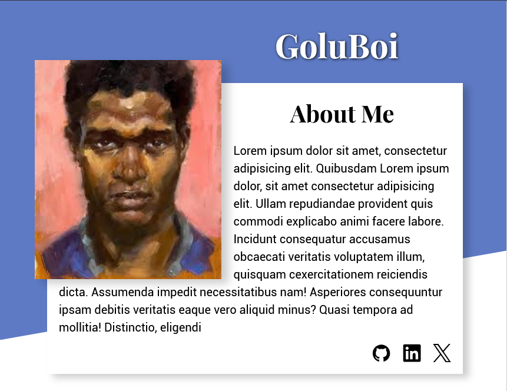

# Homepage - Personal Portfolio
A responsive personal portfolio website built with HTML, Css and Javascript.

## Preview

## What i learned
- Learned how to use media queries to style the app for different screen sizes.
- Used css properties like transform , transition to add animation.
- Understood how a good html layout can reduce the use of media queries .
- Used git commands like `--amend` to change past commits.
- Understood the benefits and use of transform-origin property.
- Understood the layout system of using `display:none` and `display:revert` on html elements for multipurpose stuff.
- Understood the use of `float` property.
- Used `<pictures>` tag for different images for different screen sizes.
- Used `object-fit` and `position-object` to align images more efficiently.

## Hardest Parts 
- How to make the app work for one screen size without breaking the other .
- How to properly position an image inside a div.
- How to attach the name in such a way that it sticks to the image for all screen sizes.
